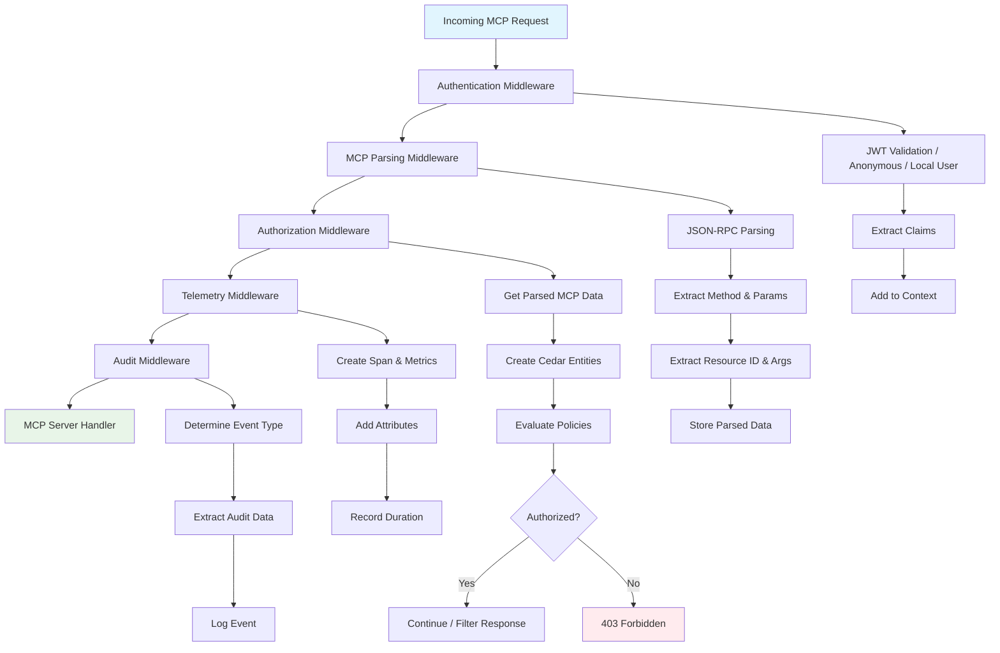
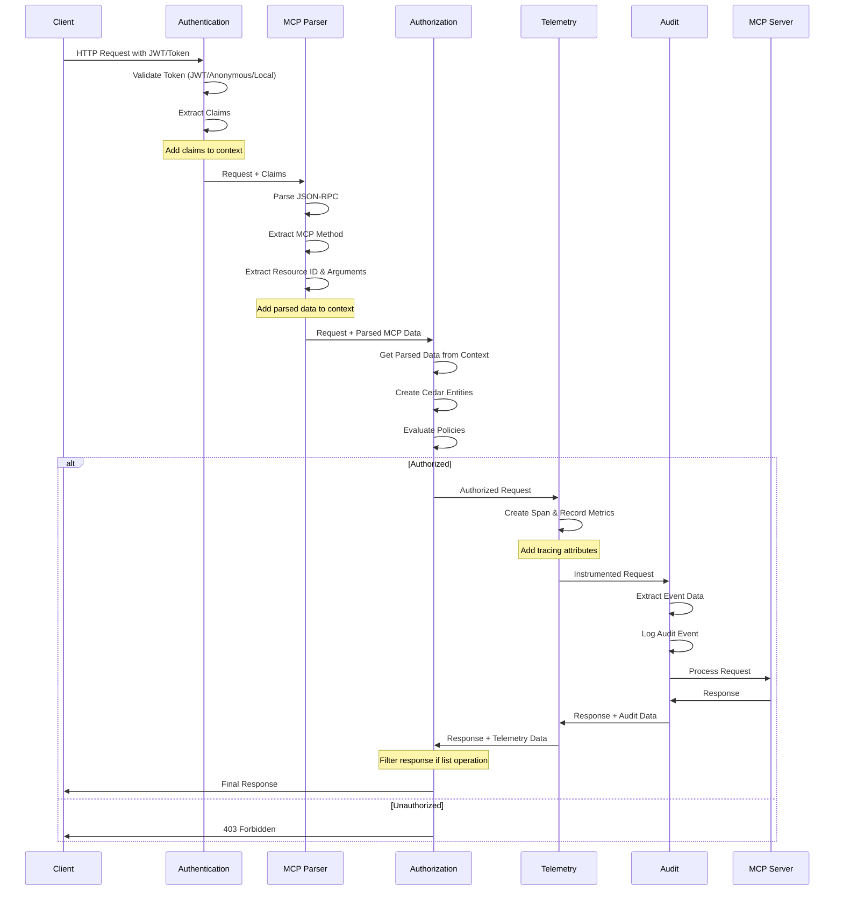
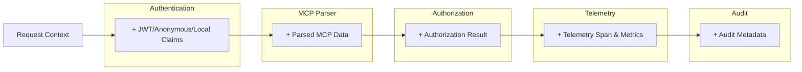
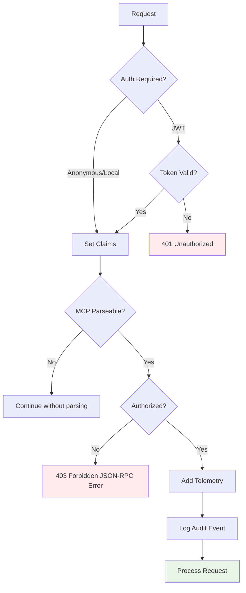

# Middleware Architecture

This document describes the middleware architecture used in ToolHive for processing MCP (Model Context Protocol) requests. The middleware chain provides authentication, parsing, authorization, auditing, and telemetry capabilities in a modular and extensible way.

## Overview

ToolHive uses a layered middleware architecture to process incoming MCP requests. Each middleware component has a specific responsibility and operates in a well-defined order to ensure proper request handling, security, and observability.

## Complete Middleware Inventory

### Core HTTP Middleware Chain

The primary middleware chain consists of the following components in order:

1. **Authentication Middleware**: Validates JWT tokens and extracts client identity
2. **MCP Parsing Middleware**: Parses JSON-RPC MCP requests and extracts structured data
3. **Authorization Middleware**: Evaluates Cedar policies to authorize requests
4. **Audit Middleware**: Logs request events for compliance and monitoring
5. **Telemetry Middleware**: Provides OpenTelemetry instrumentation for observability

### Authentication Variants

For development and testing scenarios:

6. **Anonymous Middleware**: Sets up anonymous claims for testing without authentication
7. **Local User Middleware**: Sets up local user claims with specified username for development

### Specialized Middleware

8. **Response Filtering Middleware**: Filters authorization responses for list operations
9. **SSE Connection Middleware**: Handles Server-Sent Events connection establishment

## Architecture Diagram



## Middleware Flow



## Middleware Components

### 1. Authentication Middleware

#### JWT Token Validator Middleware

**Purpose**: Validates JWT tokens and extracts client identity information.

**Location**: `pkg/auth/token.go:422`

**Responsibilities**:
- Validate JWT token signature and expiration using JWKS
- Support both JWT tokens and opaque token introspection
- Extract JWT claims (sub, name, roles, etc.)
- Add claims to request context for downstream middleware

**Context Data Added**:
- JWT claims accessible via `ClaimsContextKey{}`

#### Anonymous Middleware

**Purpose**: Sets up anonymous claims for testing and development environments.

**Location**: `pkg/auth/anonymous.go:20`

**Responsibilities**:
- Create anonymous user claims without authentication
- Provide consistent claim structure for authorization policies
- Useful for testing authorization policies without authentication

**Context Data Added**:
- Anonymous claims with predefined values (sub: "anonymous", issuer: "toolhive-local")

#### Local User Middleware

**Purpose**: Sets up local user claims with specified username for development.

**Location**: `pkg/auth/local.go:18`

**Responsibilities**:
- Create local user claims for development scenarios
- Allow testing with specific usernames
- Bypass full authentication flow while maintaining claim structure

**Context Data Added**:
- Local user claims with specified username and localhost domain

### 2. MCP Parsing Middleware

**Purpose**: Parses JSON-RPC MCP requests and extracts structured information.

**Location**: `pkg/mcp/parser.go:62`

**Responsibilities**:
- Parse JSON-RPC 2.0 messages from POST requests with JSON content
- Extract MCP method names (e.g., `tools/call`, `resources/read`)
- Extract resource IDs and arguments based on method type using method-specific handlers
- Store parsed data in request context
- Skip SSE endpoint establishment requests

**Context Data Added**:
- `ParsedMCPRequest` stored with key `MCPRequestContextKey` containing:
  - Method name
  - Request ID
  - Raw parameters (JSON)
  - Extracted resource ID
  - Extracted arguments (map[string]interface{})
  - IsRequest and IsBatch flags

**Method Handlers**:
- `initialize` → Extract client name from clientInfo
- `tools/call`, `prompts/get` → Extract name and arguments
- `resources/read` → Extract URI
- `resources/list`, `tools/list`, `prompts/list` → Extract cursor
- `progress/update` → Extract progress token
- `notifications/message` → Extract notification method
- `logging/setLevel` → Extract log level
- `completion/complete` → Extract completion reference

**Static Resource IDs**:
- `ping` → "ping"
- `notifications/roots/list_changed` → "roots"
- `notifications/initialized` → "initialized"

### 3. Authorization Middleware

**Purpose**: Evaluates Cedar policies to determine if requests are authorized.

**Location**: `pkg/authz/middleware.go:138`

**Responsibilities**:
- Skip authorization for non-POST requests and non-JSON content types
- Skip authorization for SSE endpoint establishment
- Retrieve parsed MCP data from context (set by parsing middleware)
- Map MCP methods to feature and operation pairs using `MCPMethodToFeatureOperation`
- Skip authorization for methods like "ping", "progress/update", "initialize"
- For list operations: Use response filtering to filter results based on permissions
- For non-list operations: Evaluate Cedar policies and deny with JSON-RPC error response
- Create Cedar entities (Principal, Action, Resource) from JWT claims and MCP data
- Handle unauthorized requests with proper JSON-RPC error format

**Response Filtering**:
- For list operations (`tools/list`, `prompts/list`, `resources/list`): Allow request but filter response
- Uses `ResponseFilteringWriter` to intercept and filter response items based on individual permissions
- Maintains JSON-RPC response format while filtering unauthorized items

**Dependencies**:
- Requires JWT claims from Authentication middleware
- Requires parsed MCP data from MCP Parsing middleware
- Uses Cedar policy evaluation for authorization decisions

### 4. Telemetry Middleware

**Purpose**: Provides OpenTelemetry instrumentation for HTTP requests and MCP operations.

**Location**: `pkg/telemetry/middleware.go:90`

**Responsibilities**:
- Create OpenTelemetry spans for requests with method-based naming
- Record metrics for request count, duration, and active connections
- Handle SSE endpoints with immediate connection recording
- Extract and add HTTP attributes (method, URL, user agent, etc.)
- Extract and add MCP attributes from parsed context data
- Add environment variables as attributes per configuration
- Sanitize arguments to prevent sensitive data exposure
- Record method-specific metrics (e.g., tool-specific counters)
- Capture response details and set span status

**Metrics Recorded**:
- `toolhive_mcp_requests` - Total request counter
- `toolhive_mcp_request_duration` - Request duration histogram
- `toolhive_mcp_active_connections` - Active connection gauge
- `toolhive_mcp_tool_calls` - Tool-specific call counter

**Span Attributes**:
- HTTP: method, URL, status code, content length, user agent
- MCP: method, request ID, resource ID, server name, transport type
- Environment: Configured environment variables with `environment.` prefix
- Tool-specific: Tool name, sanitized arguments for tool calls

### 5. Audit Middleware

**Purpose**: Logs request events for compliance, monitoring, and debugging.

**Location**: `pkg/audit/auditor.go:87`

**Responsibilities**:
- Handle SSE endpoints with immediate connection event logging
- Capture request and response data if configured (with size limits)
- Determine event type based on MCP method or URL path patterns
- Extract source information (client IP, user agent, request ID)
- Extract subject information from JWT claims (user ID, name, client info)
- Extract target information (endpoint, method, resource ID)
- Add metadata (duration, transport type, response size)
- Log structured audit events with proper outcome determination

**Event Types**:
- `mcp_tool_call` - Tool execution events
- `mcp_resource_read` - Resource access events  
- `mcp_prompt_get` - Prompt retrieval events
- `mcp_list_operation` - List operation events (tools/list, etc.)
- `mcp_initialize` - Client initialization events
- `sse_connection` - SSE connection establishment
- `http_request` - General HTTP request events

**Outcome Mapping**:
- 2xx → `success`
- 401/403 → `denied` 
- 4xx → `failure`
- 5xx → `error`

## Data Flow Through Context

The middleware chain uses Go's `context.Context` to pass data between components:



## Context Data Details

**Authentication Context Keys**:
- `ClaimsContextKey{}` - JWT/Anonymous/Local user claims (jwt.MapClaims)

**MCP Parser Context Keys**:
- `MCPRequestContextKey` - Parsed MCP request data (ParsedMCPRequest)

**Helper Functions**:
- `mcp.GetParsedMCPRequest(ctx)` - Get full parsed request
- `mcp.GetMCPMethod(ctx)` - Get MCP method name
- `mcp.GetMCPResourceID(ctx)` - Get resource identifier
- `mcp.GetMCPArguments(ctx)` - Get method arguments
- `auth.GetClaimsFromContext(ctx)` - Get JWT claims

## Configuration

### Enabling Middleware

The middleware chain is automatically configured when starting an MCP server with ToolHive:

```bash
# Basic MCP server (Authentication + Parsing + Audit)
thv run --transport sse --name my-server my-image:latest

# With authorization enabled
thv run --transport sse --name my-server --authz-config authz.yaml my-image:latest

# With custom audit configuration
thv run --transport sse --name my-server --audit-config audit.yaml my-image:latest
```

### Middleware Order

The middleware order is critical and enforced by the system:

1. **Authentication** - Must be first to establish client identity (JWT/Anonymous/Local)
2. **MCP Parsing** - Must come after authentication to access JWT context
3. **Authorization** - Must come after parsing to access structured MCP data
4. **Telemetry** - Must come after authorization to capture authorized request metrics
5. **Audit** - Must be last to capture the complete request lifecycle including telemetry data

### Authentication Variants

Choose one authentication middleware based on deployment scenario:

```bash
# Production with JWT validation
thv run --transport sse --name my-server --auth-config jwt.yaml my-image:latest

# Development with anonymous auth (for testing authorization policies)
thv run --transport sse --name my-server --auth anonymous my-image:latest

# Development with local user (for testing with specific username)
thv run --transport sse --name my-server --auth local --local-user "testuser" my-image:latest
```

## Error Handling

Each middleware component handles errors gracefully:



**Error Responses**:
- `401 Unauthorized` - Invalid or missing JWT token (with WWW-Authenticate header)
- `403 Forbidden` - Valid token but insufficient permissions (JSON-RPC error format for MCP requests)
- `400 Bad Request` - Malformed MCP request when parsing middleware expects valid JSON-RPC

**Authentication Error Headers**:
- JWT Middleware: Sets `WWW-Authenticate: Bearer realm="<issuer>"` with error details
- Anonymous/Local: No authentication errors (always succeeds)

**Authorization Error Format**:
For MCP requests, 403 errors are returned in JSON-RPC format:
```json
{
  "id": "request-id",
  "error": {
    "code": 403,
    "message": "Unauthorized"
  }
}
```

## Performance Considerations

### Parsing Optimization

The MCP parsing middleware uses efficient strategies:

- **Map-based method handlers** instead of large switch statements
- **Single-pass parsing** of JSON-RPC messages
- **Lazy evaluation** - only parses MCP-specific endpoints
- **Context reuse** - parsed data shared across middleware

### Authorization Caching

The authorization middleware optimizes policy evaluation:

- **Policy compilation** happens once at startup
- **Entity creation** is optimized for common patterns
- **Result caching** for repeated identical requests (when enabled)
- **Response filtering** uses buffered writers to minimize memory usage

### Telemetry Optimization

The telemetry middleware optimizes for performance:

- **JWKS caching** with automatic refresh using `jwk.Cache`
- **Metric reuse** - counters and histograms created once at startup
- **Argument sanitization** with configurable limits (100 chars per value, 200 chars total)
- **Sensitive data detection** prevents logging of tokens, passwords, etc.
- **SSE connection tracking** with immediate span completion to avoid long-running spans

## Monitoring and Observability

### Audit Events

All middleware components contribute to audit events:

```json
{
  "type": "mcp_tool_call",
  "loggedAt": "2025-06-03T13:02:28Z",
  "source": {"type": "network", "value": "192.0.2.1"},
  "outcome": "success",
  "subjects": {"user": "user123"},
  "component": "toolhive-api",
  "target": {
    "endpoint": "/messages",
    "method": "POST",
    "type": "tool",
    "resource_id": "weather"
  },
  "data": {
    "request": {"location": "New York"},
    "response": {"temperature": "22°C"}
  },
  "metadata": {
    "auditId": "uuid",
    "duration_ms": 150,
    "transport": "http"
  }
}
```

### OpenTelemetry Metrics

Key metrics tracked by the telemetry middleware:

- **`toolhive_mcp_requests`** - Total request counter with labels: method, status_code, status, mcp_method, server, transport
- **`toolhive_mcp_request_duration`** - Request duration histogram in seconds with same labels
- **`toolhive_mcp_active_connections`** - Active connection gauge with labels: server, transport, connection_type
- **`toolhive_mcp_tool_calls`** - Tool-specific call counter with labels: server, tool, status

### OpenTelemetry Traces

Span attributes include:
- **HTTP**: method, URL, status code, content length, user agent, query parameters
- **MCP**: method, request ID, resource ID, server name, backend transport, batch indicator
- **Environment**: Configurable environment variables with `environment.` prefix
- **Tool-specific**: Tool name with sanitized arguments for `tools/call`

### Legacy Metrics

Additional metrics may be tracked by other components:
- **Authorization decisions** - Permit/deny rates and reasons (via audit logs)
- **Parsing success rates** - MCP message parsing statistics (via audit logs)  
- **Error rates** - Authentication and authorization failures (via OpenTelemetry metrics)

## Extending the Middleware

### Adding New Middleware

To add new middleware to the chain:

1. **Implement the interface**: Create a function with signature `func(http.Handler) http.Handler`
2. **Choose the position**: Insert in the correct order based on dependencies:
   - Before MCP parsing: If you need raw request data
   - After parsing: If you need structured MCP data
   - After authorization: If you only process authorized requests
3. **Handle context data**: Use existing context keys or add new ones
4. **Update configuration**: Add middleware configuration to runner config
5. **Add tests**: Include comprehensive middleware tests
6. **Update documentation**: Document the new middleware in this file

**Example middleware template**:
```go
func MyMiddleware(config MyConfig) func(http.Handler) http.Handler {
    return func(next http.Handler) http.Handler {
        return http.HandlerFunc(func(w http.ResponseWriter, r *http.Request) {
            // Pre-processing
            ctx := r.Context()
            
            // Add data to context if needed
            ctx = context.WithValue(ctx, MyContextKey{}, myData)
            
            // Call next middleware
            next.ServeHTTP(w, r.WithContext(ctx))
            
            // Post-processing (optional)
        })
    }
}
```

### Custom Authorization Policies

See the [Authorization Framework](authz.md) documentation for details on writing Cedar policies.

### Custom Audit Events

The audit middleware can be extended to capture additional event types and data fields based on your requirements.

## Troubleshooting

### Common Issues

**Middleware Order Problems**:
- Ensure authentication runs before all other middleware
- Ensure MCP parsing runs before authorization and audit
- Ensure telemetry runs before audit to capture metrics
- Check that all required middleware is included in tests
- Verify authentication variant selection (only use one: JWT, anonymous, or local user)

**Context Data Missing**:
- Verify middleware order is correct
- Check that upstream middleware completed successfully
- Ensure context keys are correctly defined and used

**Performance Issues**:
- Monitor middleware execution time using OpenTelemetry traces
- Check for inefficient policy evaluation in authorization middleware
- Consider enabling authorization result caching
- Verify telemetry argument sanitization limits are appropriate
- Monitor JWKS cache performance for JWT validation
- Check audit log file permissions and disk space

### Debug Information

Enable debug logging to see middleware execution:

```bash
export LOG_LEVEL=debug
thv run --transport sse --name my-server my-image:latest
```

This will show detailed information about each middleware component's execution and data flow.